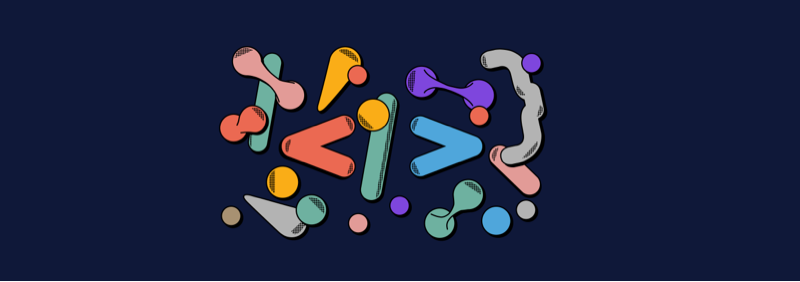
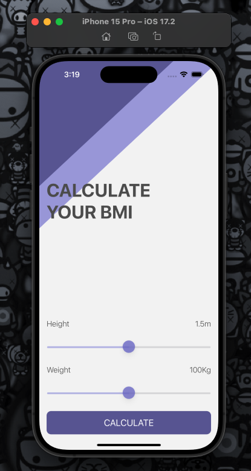
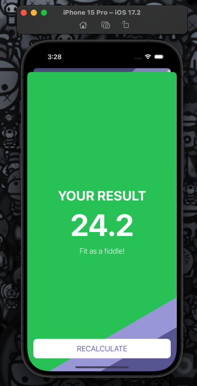

#  BMI Calculator

    
    

## The Goal

The goal of this proyect is to understanding of the MVC design pattern and to introduce the concept of Classes. We’ll compare objects created from classes with instances of Structs. This entire project using UIKit technology for the creation of storyboards and user interfaces (UI).

## What was created

A body mass index calculator was created. Based on the user's weight and height, their body mass is calculated and health advice will be given based on whether they have eaten too many cakes or if they need to eat more cakes.

